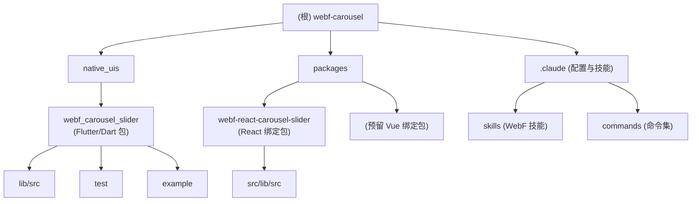

# WebF Carousel Slider

<!-- webf-agents:init start -->
## WebF Claude Code Skills

Source: `@openwebf/claude-code-skills@1.0.2`

### Skills
- `webf-api-compatibility` — Check Web API and CSS feature compatibility in WebF - determine what JavaScript APIs, DOM methods, CSS properties, and layout modes are supported. Use when planning features, debugging why APIs don't work, or finding alternatives for unsupported features like IndexedDB, WebGL, float layout, or CSS Grid. (`.claude/skills/webf-api-compatibility/SKILL.md`)
- `webf-async-rendering` — Understand and work with WebF's async rendering model - handle onscreen/offscreen events and element measurements correctly. Use when getBoundingClientRect returns zeros, computed styles are incorrect, measurements fail, or elements don't layout as expected. (`.claude/skills/webf-async-rendering/SKILL.md`)
- `webf-hybrid-ui-dev` — Develop custom native/hybrid UI libraries based on Flutter widgets for WebF. Create reusable component libraries that wrap Flutter widgets as web-accessible custom elements. Use when building UI libraries, wrapping Flutter packages, or creating native component systems. (`.claude/skills/webf-hybrid-ui-dev/SKILL.md`)
- `webf-infinite-scrolling` — Create high-performance infinite scrolling lists with pull-to-refresh and load-more capabilities using WebFListView. Use when building feed-style UIs, product catalogs, chat messages, or any scrollable list that needs optimal performance with large datasets. (`.claude/skills/webf-infinite-scrolling/SKILL.md`)
- `webf-native-plugin-dev` — Develop custom WebF native plugins based on Flutter packages. Create reusable plugins that wrap Flutter/platform capabilities as JavaScript APIs. Use when building plugins for native features like camera, payments, sensors, file access, or wrapping existing Flutter packages. (`.claude/skills/webf-native-plugin-dev/SKILL.md`)
- `webf-native-plugins` — Install WebF native plugins to access platform capabilities like sharing, payment, camera, geolocation, and more. Use when building features that require native device APIs beyond standard web APIs. (`.claude/skills/webf-native-plugins/SKILL.md`)
- `webf-native-ui` — Setup and use WebF's Cupertino UI library to build native iOS-style UIs with pre-built components instead of crafting everything with HTML/CSS. Use when building iOS apps, adding native UI components, or improving UI performance. (`.claude/skills/webf-native-ui/SKILL.md`)
- `webf-quickstart` — Get started with WebF development - setup WebF Go, create a React/Vue/Svelte project with Vite, and load your first app. Use when starting a new WebF project, onboarding new developers, or setting up development environment. (`.claude/skills/webf-quickstart/SKILL.md`)
- `webf-routing-setup` — Setup hybrid routing with native screen transitions in WebF - configure navigation using WebF routing instead of SPA routing. Use when setting up navigation, implementing multi-screen apps, or when react-router-dom/vue-router doesn't work as expected. (`.claude/skills/webf-routing-setup/SKILL.md`)

### References
- `webf-api-compatibility`: `.claude/skills/webf-api-compatibility/alternatives.md`, `.claude/skills/webf-api-compatibility/reference.md`
- `webf-async-rendering`: `.claude/skills/webf-async-rendering/examples.md`
- `webf-hybrid-ui-dev`: `.claude/skills/webf-hybrid-ui-dev/example-input.md`, `.claude/skills/webf-hybrid-ui-dev/typescript-guide.md`
- `webf-infinite-scrolling`: `.claude/skills/webf-infinite-scrolling/examples.md`
- `webf-native-plugins`: `.claude/skills/webf-native-plugins/reference.md`
- `webf-native-ui`: `.claude/skills/webf-native-ui/reference.md`
- `webf-quickstart`: `.claude/skills/webf-quickstart/reference.md`
- `webf-routing-setup`: `.claude/skills/webf-routing-setup/cross-platform.md`, `.claude/skills/webf-routing-setup/examples.md`
<!-- webf-agents:init end -->

---

## 变更记录 (Changelog)

### 2026-01-06
- 初始化 AI 上下文文档
- 完成项目架构扫描与模块分析
- 生成根级与模块级 CLAUDE.md 索引
- 建立模块结构图与导航体系

---

## 项目愿景

WebF Carousel Slider 是一个基于 Flutter 的高性能轮播组件库，通过 WebF 框架为 JavaScript/TypeScript 生态系统提供原生渲染能力。项目旨在：

1. **混合架构范式** - 结合 Flutter 的高性能渲染与 Web 的开发便利性
2. **跨框架支持** - 提供 React/Vue 等多框架绑定
3. **类型安全** - 完整的 TypeScript 类型定义与 Dart 类型系统
4. **开发体验** - 简洁的 API 设计与丰富的配置选项

---

## 架构总览

### 技术栈

- **Flutter/Dart** - 原生渲染引擎 (Dart SDK >= 3.0.0, Flutter >= 3.16.0)
- **WebF Framework** - 混合 UI 框架 (^0.24.1)
- **carousel_slider_plus** - 底层轮播组件库 (^7.1.1)
- **TypeScript** - JavaScript 生态类型定义
- **React** - 前端框架绑定 (peer dependency)

### 核心设计

```
JavaScript 层 (React/Vue)
         ↓
WebF Custom Element API
         ↓
Dart WidgetElement 包装
         ↓
Flutter carousel_slider_plus
```

---

## 模块结构图



---

## 模块索引

| 模块路径 | 语言 | 职责 | 状态 |
|---------|------|------|------|
| `native_uis/webf_carousel_slider` | Dart | Flutter 包 - WebF Custom Element 实现 | ✅ 完整 |
| `packages/webf-react-carousel-slider` | TypeScript | React 组件绑定 - 基于 @openwebf/react-core-ui | ✅ 完整 |
| `.claude/skills` | Markdown | WebF 开发技能库与参考文档 | ✅ 完整 |
| `.claude/commands` | Markdown | Spec 工作流命令集 | ✅ 完整 |
| `.spec-workflow` | Markdown/Templates | 用户自定义模板与规范工作流 | ✅ 完整 |

---

## 运行与开发

### Flutter 包开发

```bash
# 进入 Flutter 包目录
cd native_uis/webf_carousel_slider

# 安装依赖
flutter pub get

# 运行测试
flutter test

# 运行示例应用
cd example
flutter run
```

### React 包开发

```bash
# 进入 React 包目录
cd packages/webf-react-carousel-slider

# 安装依赖
npm install

# 构建类型定义与分发文件
npm run build
```

### 代码生成（使用 WebF CLI）

```bash
# 安装 WebF CLI
npm install -g @openwebf/webf-cli

# 生成 React 组件
webf codegen webf-carousel-slider-react \
  --flutter-package-src=./native_uis/webf_carousel_slider \
  --framework=react
```

---

## 测试策略

### Flutter 包测试

- **单元测试** - `test/carousel_slider_widget_test.dart`
  - Widget 渲染测试
  - CarouselOptions 配置验证
  - 边界条件与属性验证
  - 集成测试场景

- **测试工具** - `flutter_test` + `mockito`

### React 包测试

- 当前版本未包含测试文件
- 建议添加：`jest` + `@testing-library/react`

### 测试覆盖率

| 模块 | 覆盖率 | 状态 |
|------|--------|------|
| Flutter 包 | ~80% (widget + options 测试) | ✅ 已覆盖核心功能 |
| React 包 | 0% | ⚠️ 待补充 |
| 集成测试 | 手动测试 (example 应用) | ⚠️ 待自动化 |

---

## 编码规范

### Dart/Flutter

- 遵循 [Effective Dart](https://dart.dev/guides/language/effective-dart)
- 使用 `flutter_lints` ^6.0.0
- 所有 public API 需要文档注释
- 优先使用类型安全的 `enum` 替代字符串常量

### TypeScript

- 严格模式 `strict: true`
- 使用 ESNext target 与 module
- 所有组件导出需要 JSDoc 注释
- Props 接口必须包含默认值说明

### Git 提交规范

遵循 Conventional Commits：
- `✨ feat` - 新功能
- `🐛 fix` - 缺陷修复
- `♻️ refactor` - 重构
- `📦 build` - 构建系统
- `📝 docs` - 文档

---

## AI 使用指引

### 开发场景

1. **添加新属性到 Custom Element**
   - 修改 `lib/src/carousel_slider.dart` 的 `CarouselSliderElement`
   - 更新 `lib/src/carousel_slider.d.ts` 类型定义
   - 重新生成 React 绑定

2. **扩展事件系统**
   - 在 `CarouselSliderElementState._onPageChanged` 中派发事件
   - 更新 TypeScript `CarouselSliderEvents` 接口
   - 在 React 组件 `events` 配置中注册

3. **性能优化**
   - 参考 `.claude/skills/webf-infinite-scrolling`
   - 使用 WebF Controller 管理实例生命周期
   - 避免频繁的 state 更新

### 相关技能

- **混合 UI 开发** - 使用 `.claude/skills/webf-hybrid-ui-dev/SKILL.md`
- **API 兼容性** - 使用 `.claude/skills/webf-api-compatibility/SKILL.md`
- **异步渲染** - 使用 `.claude/skills/webf-async-rendering/SKILL.md`

---

## 相关资源

- [WebF 官方文档](https://openwebf.com/)
- [carousel_slider_plus 包](https://pub.dev/packages/carousel_slider_plus)
- [WebF Hybrid UI 指南](https://github.com/openwebf/webf/tree/main/.claude/skills/webf-hybrid-ui-dev)
- [项目仓库](https://github.com/example/carousel-slider-webf)

---

**最后更新**: 2026-01-06
**文档版本**: 1.0.0
